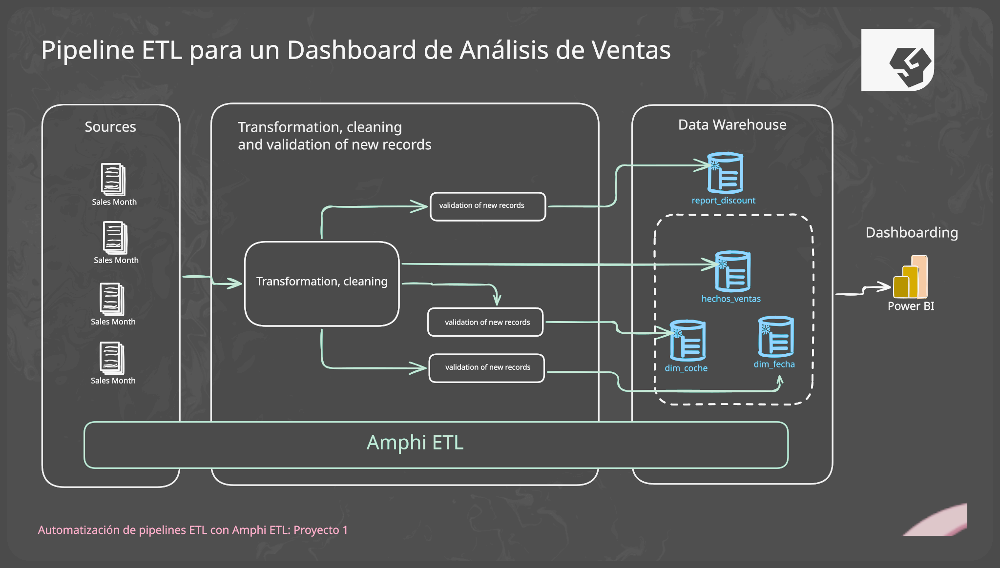

## **Brief del Proyecto: Pipeline ETL para Dashboard de Análisis de ventas**

**1. Título del Proyecto:** Pipeline ETL para Dashboard de Análisis de ventas, mediante la Automatización ETL con Amphi

**2. Nombre del Cliente (Ficticio):** Tu Auto Ya, F.A. de K.E.

**3. Contexto del Cliente:** Tu Auto Ya es uno de los distribuidores automotrices líderes en México, con una extensa red de agencias a lo largo del país. Representan una amplia gama de marcas de vehículos y tienen un volumen significativo de datos de ventas generados diariamente a través de sus múltiples puntos de venta. A pesar de su éxito, la empresa ha identificado la necesidad de modernizar sus procesos de análisis de datos para obtener información más rápida y precisa sobre su rendimiento de ventas. Actualmente, gran parte de este análisis se realiza de forma manual utilizando hojas de cálculo, lo que resulta en ineficiencias y posibles errores.

**4. Declaración del Problema de Negocio:** Tu Auto Ya enfrenta desafíos para consolidar y analizar de manera eficiente los datos de ventas provenientes de sus diversas agencias y marcas. La dependencia de procesos manuales en hojas de cálculo consume tiempo valioso, limita la capacidad de generar informes y dificulta la identificación rápida de tendencias y patrones clave en el rendimiento de ventas. Esta situación impide una toma de decisiones ágil y basada en datos para optimizar estrategias comerciales, gestionar inventarios y mejorar el rendimiento de los equipos de ventas.

**5. Objetivos del Proyecto:**

* Diseñar y construir un pipeline de datos ETL utilizando la herramienta Amphi para automatizar la extracción, transformación y carga de datos de ventas.
* Establecer una conexión con los datos de ventas almacenados en archivos CSV.
* Transformar los datos para asegurar su calidad y consistencia, preparándolos para su carga en un modelo tipo estrella en un datawarehouse de Snowflake (este último punto es el destino final, pero el foco del proyecto es el pipeline ETL).
* Automatizar el proceso de manera que los datos de ventas puedan ser procesados de forma regular y eficiente.
* Proporcionar una base para la generación de un dashboard de ventas que permita a Tu Auto Ya visualizar sus métricas clave.

**6. Alcance del Proyecto:**

El equipo de Tamarindo Insights by Datos a la Mexicana deberá realizar las siguientes tareas:

* **Extracción:** Configurar la conexión en Amphi para extraer los datos de ventas desde los archivos CSV.
* **Transformación:**
    * Definir y aplicar las transformaciones necesarias para limpiar y estructurar los datos (ej: conversión de tipos de datos, manejo de valores faltantes, creación de campos calculados si es necesario).
    * Diseñar la lógica para adaptar los datos al modelo tipo estrella requerido para el datawarehouse (identificación de dimensiones y hechos).
* **Carga:** Configurar la salida del pipeline en Amphi para cargar los datos transformados. Aunque el objetivo final es Snowflake, para este proyecto el entregable principal será el pipeline de Amphi y la demostración de la transformación de los datos.
* **Documentación:** Documentar el pipeline ETL creado en Amphi, incluyendo la descripción de cada paso y las transformaciones aplicadas.

**7. Descripción de los Datos:**

Se proporcionaran archivos CSV que contiene datos históricos de ventas. Este archivo incluye campos como la fecha de la venta, el nombre del vendedor, el nombre del cliente, la marca y modelo del coche vendido, el año del coche, el precio de venta, la tasa de comisión y la comisión ganada. Estos datos son representativos de la información de ventas que Tu Auto Ya genera diariamente y son fundamentales para analizar el rendimiento comercial, las tendencias de ventas por modelo y marca, y la efectividad de los equipos de ventas.

**8. Entregables Esperados:**

* Un pipeline ETL funcional creado con la herramienta Amphi.
* Un archivo de exportación del pipeline de Amphi.
* Documentación detallada del pipeline, incluyendo un diagrama de flujo y la descripción de cada componente y transformación realizada.
* Una presentación breve explicando el diseño del pipeline y los beneficios de la automatización para Tu Auto Ya.

**9. Criterios de Éxito:**

* El pipeline ETL en Amphi debe ser capaz de extraer los datos del archivo CSV.
* Los datos deben ser transformados correctamente según la lógica definida para adaptarse al modelo tipo estrella.
* El proceso de ETL debe ejecutarse sin errores.
* La documentación debe ser clara y completa, permitiendo entender el funcionamiento del pipeline.

**10. Consideraciones Adicionales (Opcional):**

* Se espera que los estudiantes utilicen la herramienta Amphi ETL para construir el pipeline, aprovechando su interfaz visual y funcionalidades low-code.
* Aunque la carga final es en Snowflake, para este proyecto se puede simular la carga a un archivo CSV de salida para verificar la correcta transformación de los datos.

Este brief de proyecto simula una solicitud real de Tu Auto Ya a Tamarindo Insights by Datos a la Mexicana y proporciona un contexto claro para que los estudiantes del curso "Deja Excel y Automatiza tus Datos con Amphi ETL - Pipelines ETL para Principiantes" practiquen la creación de ETLs robustos y eficientes utilizando Amphi. ¡Espero que este proyecto sea de utilidad para el desarrollo de tus habilidades y conocimientos necesarios para enfrentar desafíos reales en el mundo laboral!